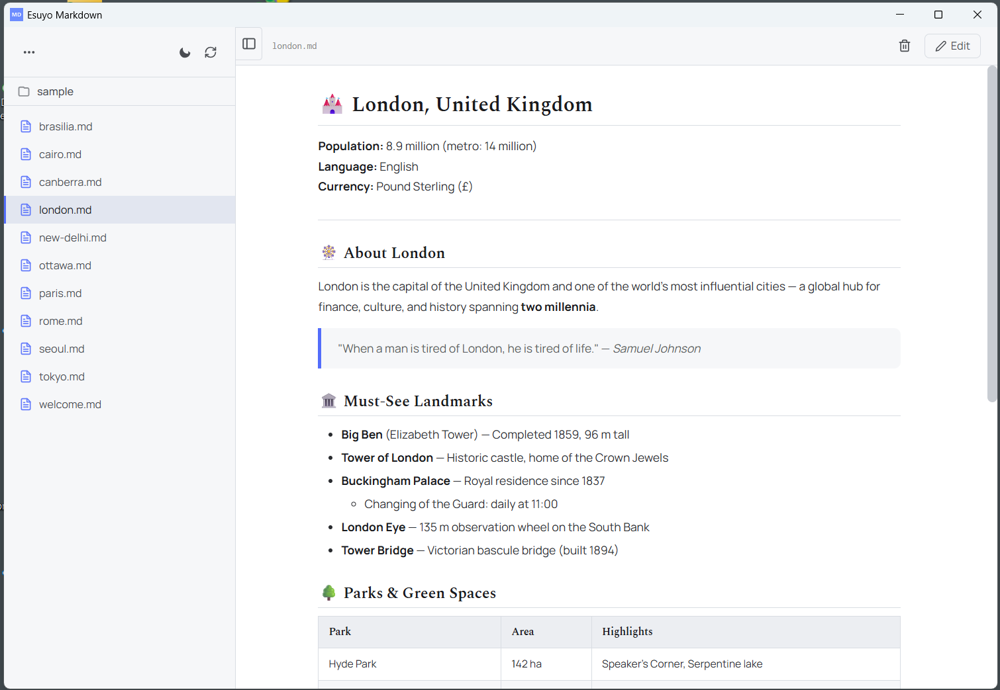
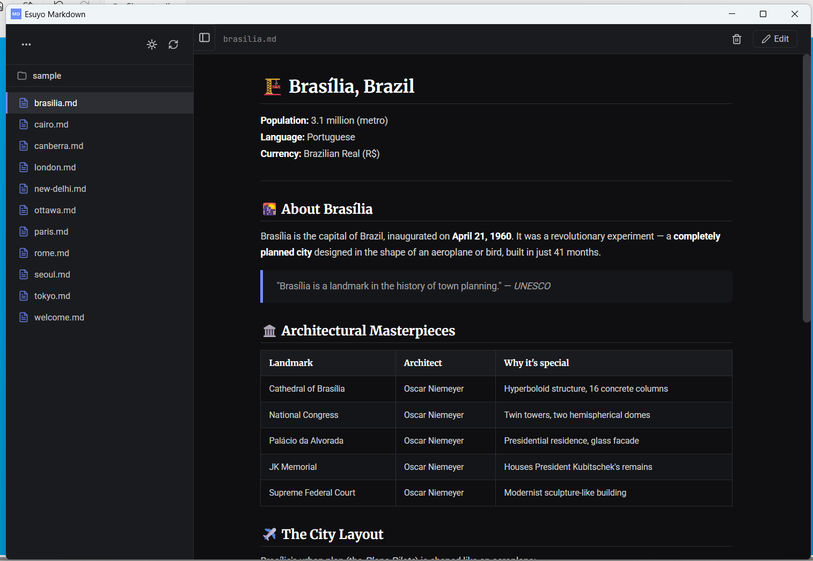
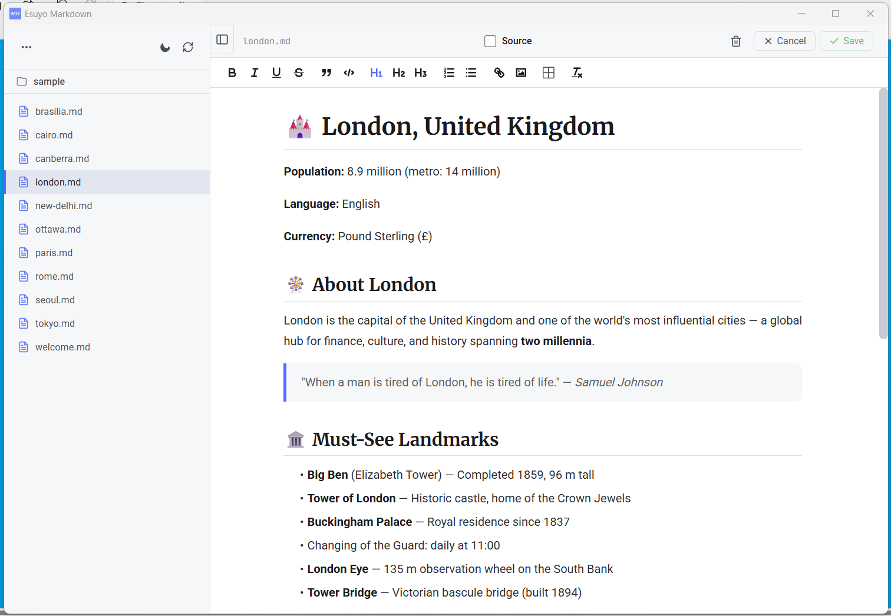
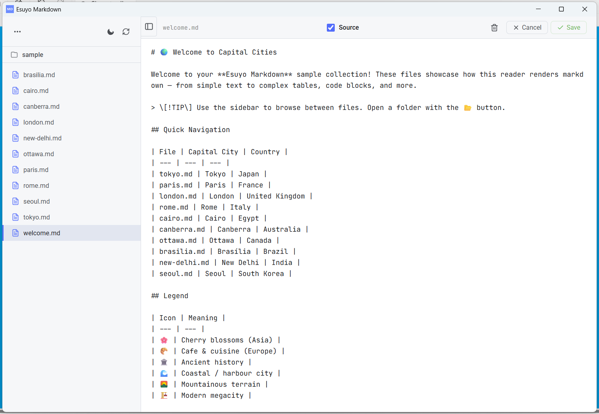
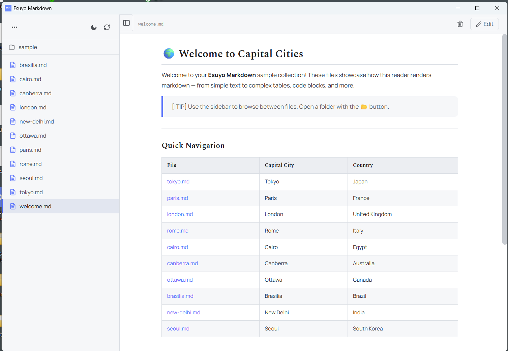
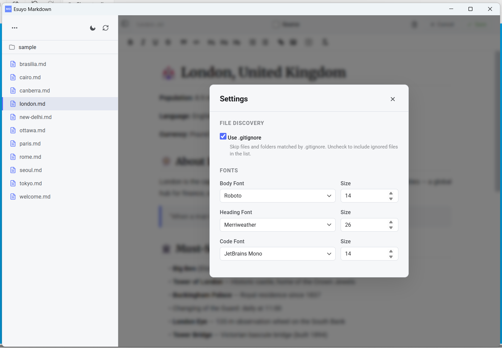

# Esuyo Markdown

A desktop markdown reader built with [Tauri](https://v2.tauri.app/) v2, [Vite](https://vite.dev/), and vanilla JavaScript.

Browse a folder of markdown files, read them with a clean rendered view, customize the theme and fonts, and navigate with keyboard shortcuts.

## Screenshots

| | |
| :---: | :---: |
|  |  |
| **Normal view** | **Dark mode** |
|  |  |
| **Editing mode** | **Raw source editing** |
|  |  |
| **Welcome** | **Settings** |

## Prerequisites

- **Node.js** 18+ and npm
- **Rust** toolchain (`stable-x86_64-pc-windows-gnu`)
- **w64devkit** (provides `dlltool.exe` — required on Windows when MSVC tools are not available)

### Toolchain setup (Windows)

The Rust toolchain uses the GNU target and w64devkit for linking. Install w64devkit at:

```
C:\tools\w64devkit\w64devkit\bin
```

Then add both Rust's cargo bin and w64devkit to your PATH before running any Tauri commands:

```powershell
$env:Path += ";C:\tools\w64devkit\w64devkit\bin"
$env:Path += ";$env:USERPROFILE\.cargo\bin"
```

> **Tip:** Add these lines to your `$PROFILE` to avoid typing them each time.

---

## Development

Run the app in development mode (Vite dev server + Tauri window):

```powershell
$env:Path += ";C:\tools\w64devkit\w64devkit\bin"; $env:Path += ";$env:USERPROFILE\.cargo\bin"; npx tauri dev
```

> **Important:** On Windows, this must be run from an **Administrator terminal**. Windows Defender's Application Control policy may block Cargo build scripts (error `4551`) when running without elevated privileges.

#### Clearing build caches

If you encounter stale build errors or the Application Control policy blocks previously compiled artifacts, clear the Rust build cache:

```powershell
cd src-tauri; cargo clean
```

Or nuke everything (Rust + Node):

```powershell
Remove-Item -Recurse -Force src-tauri\target, node_modules\.vite -ErrorAction SilentlyContinue
```

This will:
1. Start the Vite dev server on `http://localhost:1420`
2. Compile and launch the Tauri desktop app pointing at that dev server
3. The app will hot-reload when you edit frontend files

### Frontend-only dev

If you only need to work on the UI without the Tauri shell:

```powershell
npm run dev
```

Then open `http://localhost:1420` in a browser (some Tauri APIs won't be available).

### Rust-only check

To verify the Rust backend compiles without starting the app:

```powershell
$env:Path += ";C:\tools\w64devkit\w64devkit\bin"; $env:Path += ";$env:USERPROFILE\.cargo\bin"; cd src-tauri; cargo check
```

---

## Production build

Build a distributable production package (Windows installer, portable, or MSI depending on target):

```powershell
$env:Path += ";C:\tools\w64devkit\w64devkit\bin"; $env:Path += ";$env:USERPROFILE\.cargo\bin"; npx tauri build
```

The output will be placed in:

```
src-tauri/target/release/bundle/
```

The `tauri.conf.json` controls bundle settings (currently configured for `"targets": "all"`, which produces `.msi`, `.exe` (NSIS), and portable variants).

### What happens during build

1. `npm run build` is executed to produce the minified frontend in `dist/`
2. The Rust backend is compiled in release mode
3. The frontend is embedded into the binary
4. Platform-specific installers are generated

---

## Project structure

```
esuyo-markdown/
├── index.html              # App entry point
├── package.json
├── vite.config.js
├── src/
│   ├── main.js             # Frontend logic (file scanning, markdown rendering, settings)
│   ├── style.css           # App chrome (sidebar, layout, menu, settings)
│   └── markdown-theme.css  # User-customizable markdown presentation
└── src-tauri/
    ├── Cargo.toml
    ├── tauri.conf.json
    ├── capabilities/
    │   └── default.json
    └── src/
        ├── lib.rs          # Rust commands (pick_folder, scan_md_files, read_file, settings)
        └── main.rs
```

## Keyboard shortcuts

| Key | Action |
|-----|--------|
| `ArrowUp` | Previous file in list |
| `ArrowDown` | Next file in list |

## Features

- Open a folder and browse all `.md` and `.markdown` files recursively
- Respects `.gitignore` patterns and built-in ignore list (`node_modules`, `.git`, etc.)
- Syntax-highlighted code blocks (via highlight.js)
- Light/dark theme toggle
- Customizable fonts (Google Fonts via settings panel)
- Collapsible sidebar
- Recent folders menu
- Persistent settings (theme, fonts, recent folders)
