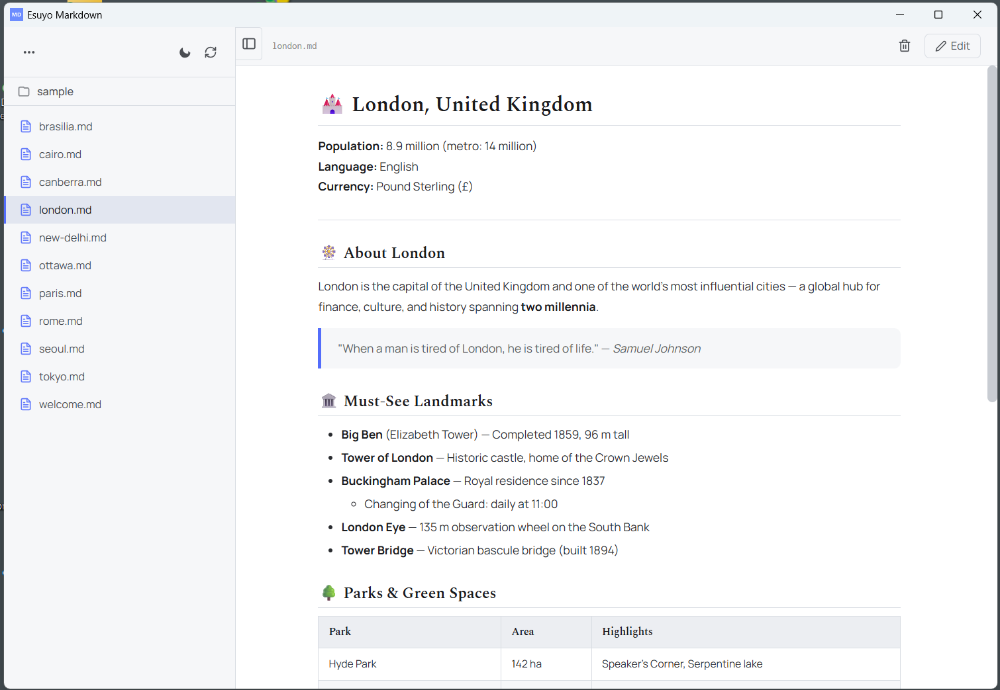
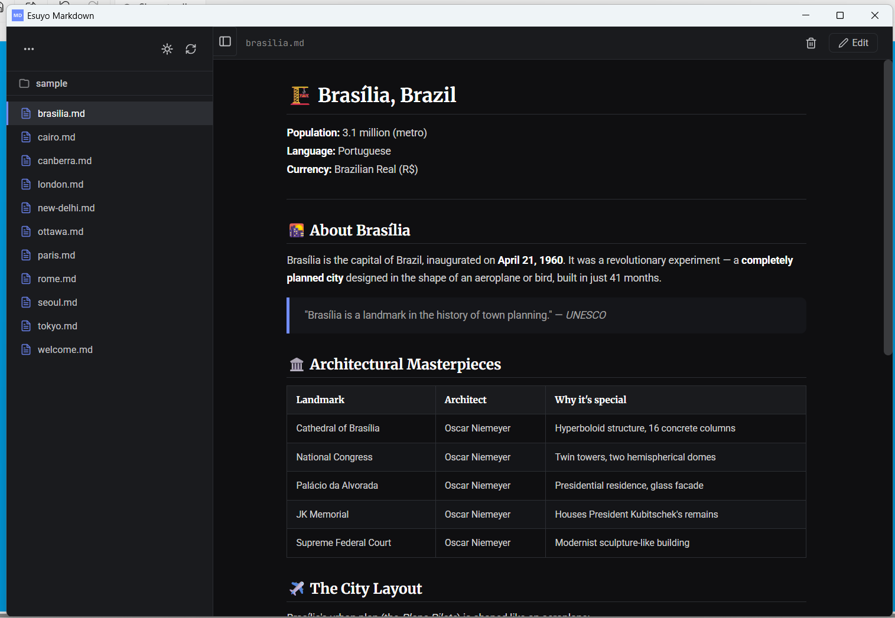
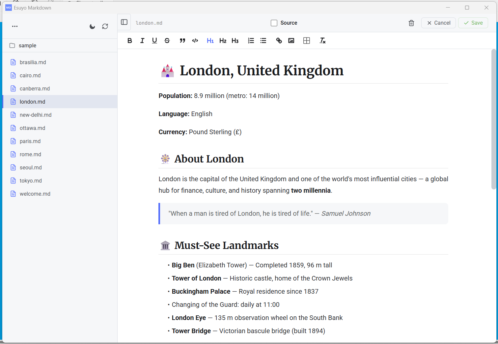
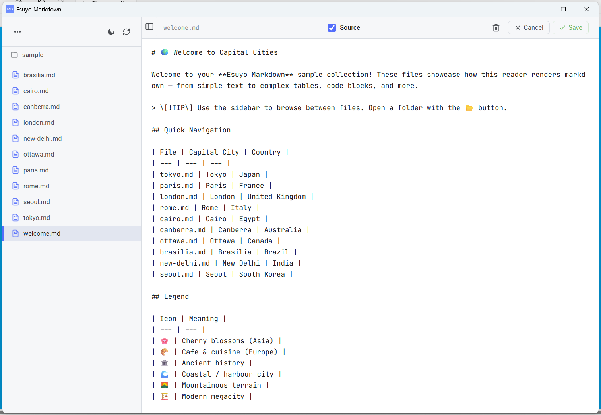
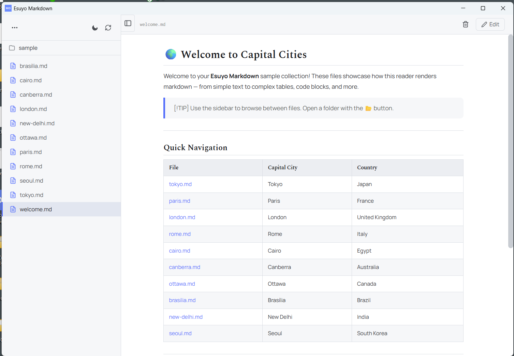
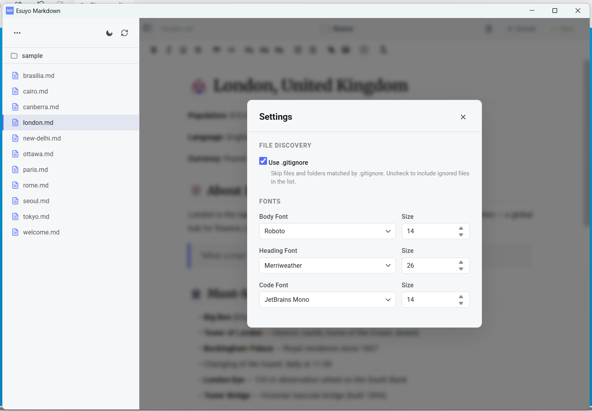

# Esuyo Markdown

> A fast, private desktop reader and editor for your Markdown files.

Esuyo Markdown is a desktop app for people who keep notes, docs, or wikis as Markdown files. Point it at any folder and browse every `.md` file inside — read with a clean rendered view, then edit in rich text or raw source and save back to disk. Everything stays local on your computer; there are no accounts and no cloud sync. See `PRIVACY.md` for details.

## Screenshots

| | |
| :---: | :---: |
|  |  |
| **Normal view** | **Dark mode** |
|  |  |
| **Editing mode** | **Raw source editing** |
|  |  |
| **Welcome** | **Settings** |

## Features

- Open any folder and browse all `.md` and `.markdown` files recursively
- Clean rendered reading view with syntax-highlighted code blocks and GFM tables
- Rich-text editing (bold, lists, tables, code) plus a raw Markdown source mode
- New file, Save, Save As, and Delete (deleted files go to the Recycle Bin / Trash)
- Light and dark themes with customizable body, heading, and code fonts and sizes
- Respects `.gitignore` (toggleable) and skips folders like `node_modules` and `.git`
- Collapsible sidebar, recent-folders menu, and persistent settings
- Keyboard navigation: `↑` / `↓` to move between files, `Ctrl/⌘ + N` for new file, `Ctrl/⌘ + S` to save while editing
- Fully offline except Google Fonts loading — no accounts, no telemetry

## Prerequisites

- **Windows 10/11, macOS, or Linux** (64-bit).
- **Windows:** WebView2 is required. The Microsoft Store build includes it (offline installer); otherwise WebView2 is already present on most up-to-date Windows installs.
- **Linux:** WebKit/GTK system libraries (only needed if you install the `.deb` / `.AppImage` on a minimal distro).
- No Node.js, Rust, or build tools are needed to *run* the app — those are only for contributors (see `./docs/development.md`).

## Installation

1. Go to the **Releases** page of this repository (`Releases` → latest `vX.Y.Z`).
2. Download the installer for your OS:
   - **Windows:** `.msi` or `.exe` (NSIS) installer, or `.msix` for the Microsoft Store submission build.
   - **macOS:** `.dmg`.
   - **Linux:** `.AppImage` or `.deb`.
3. Install / run it:
   - Windows: run the `.msi` / `.exe` installer.
   - macOS: open the `.dmg` and drag the app to Applications.
   - Linux AppImage: make it executable (`chmod +x *.AppImage`) and run it; `.deb`: `sudo apt install ./esuyo-markdown*.deb`.
4. Launch **Esuyo Markdown** from your app menu.

Want to try it with sample content? This repo ships a `sample/` folder with 11 Markdown files — open that folder from inside the app.

## Configuration

No environment variables or config files are required. Everything is set inside the app:

- **Open Settings** from the `···` menu → **Settings**.
- **Appearance:** switch Light / Dark with the sun/moon button in the sidebar header, or from Settings.
- **Fonts:** pick Body, Heading, and Code fonts (Google Fonts) plus sizes. Font files load from Google Fonts, so an internet connection is needed for non-system fonts.
- **File Discovery:** `Use .gitignore` (on by default) — uncheck to also list Markdown files inside ignored folders such as `node_modules`.
- Settings (theme, fonts, recent folders) are stored locally in `settings.json` in your OS app-data directory and never leave your device.

## Quick Start / Usage

1. Click **Open Folder** in the sidebar (or `···` → **Open Folder**) and pick a directory containing Markdown files.
2. Browse files in the left sidebar; click one to read it. Use `↑` / `↓` to move between files.
3. Click **Edit** (top-right of the reading view) to edit in rich text. Check **Source** to edit raw Markdown instead; uncheck to return to rich text.
4. Click **Save** (or `Ctrl/⌘ + S`) to write back to disk, **Save As** from the `···` menu to save a copy, or **Cancel** to discard changes.
5. Click **New File** (`···` → **New File**, or `Ctrl/⌘ + N`) to create a file, or the trash icon to delete the current file (it moves to the Recycle Bin / Trash, not permanent delete).
6. Use the sidebar toggle to collapse the file list, and the reload button to re-scan the folder after external changes.

## Troubleshooting / FAQ

**No files listed after opening a folder?**
The folder may only contain Markdown inside ignored directories. Uncheck `Use .gitignore` in Settings, or press the reload button in the sidebar header.

**My code blocks look plain?**
The language is auto-detected; blocks without a language tag (bare ` ``` `) render as plaintext. Add a language (e.g. ` ```js `) for highlighting.

**I deleted a file by accident — is it gone?**
No. Delete moves the file to your OS Recycle Bin / Trash. Restore it from there.

**Fonts don't change / look wrong offline?**
Custom fonts load from Google Fonts (`fonts.googleapis.com`). Offline, the app falls back to system fonts. Pick a system font or reconnect to apply web fonts.

**Does the app upload my notes anywhere?**
No. Files and settings stay on your disk. The only network request is font loading. See `PRIVACY.md`.

## License

GNU Affero General Public License v3.0 — see `LICENSE`.

## Developer Documentation

- [Architecture](./docs/architecture.md) — Tech stack, process model, and data flow
- [Project Structure](./docs/project-structure.md) — Directory layout and file roles
- [Development Guide](./docs/development.md) — Local setup, run modes, and debugging
- [Build and Deployment](./docs/build-and-deployment.md) — Versioning, CI releases, and Store submission
- [Reference](./docs/reference.md) — Tauri commands, settings schema, and shortcuts
- [AI Assistant Plan](./docs/ai-assistant-plan.md) — Proposal: OpenAI-compatible assistant (not yet implemented)
- [Git Sync Plan](./docs/git-sync-plan.md) — Proposal: Git clone/status/push/pull via system git (not yet implemented)
